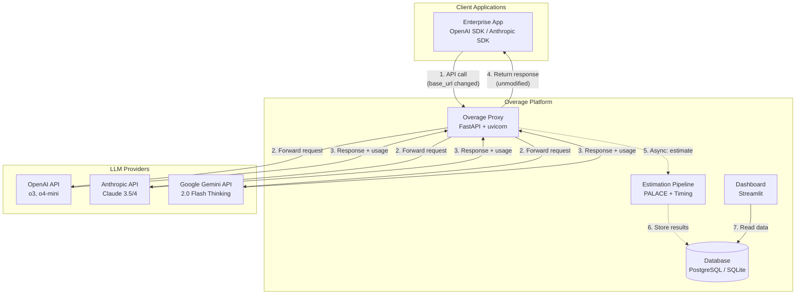
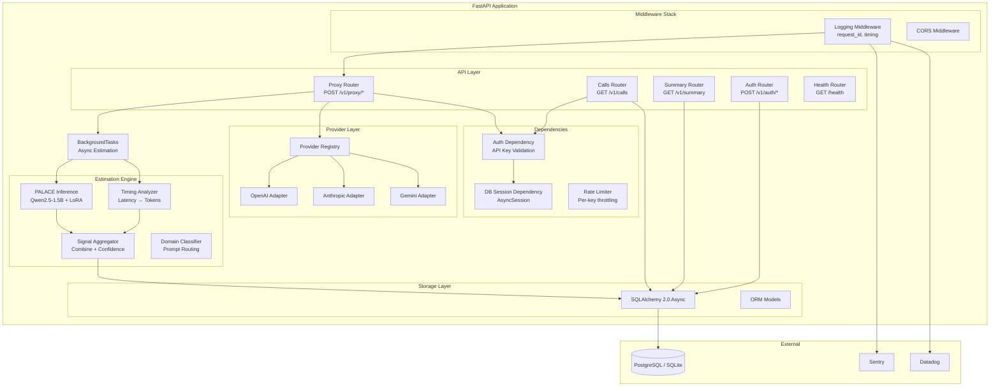
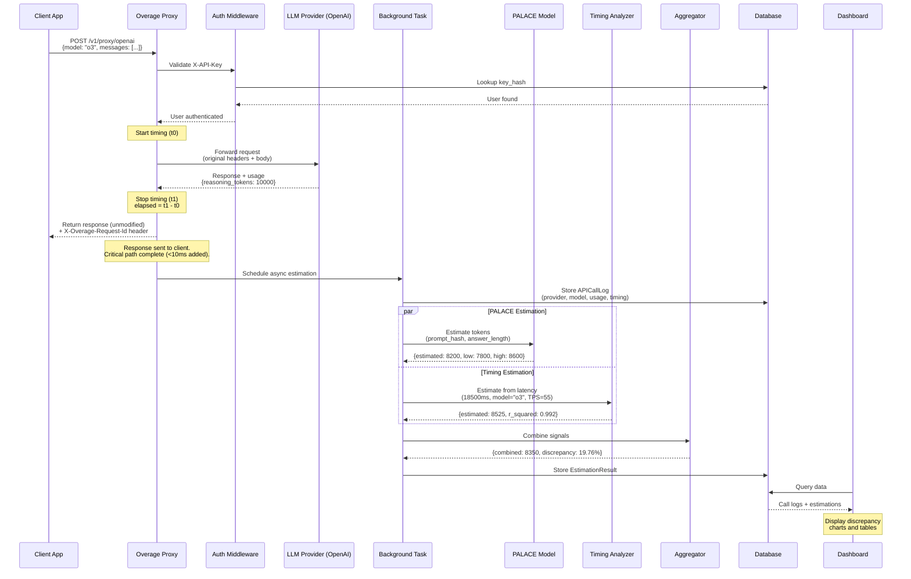

# ARCHITECTURE.md — Overage System Architecture

> **Version:** 0.1.0 (MVP)
> **Last Updated:** March 31, 2026

---

## 1. SYSTEM CONTEXT DIAGRAM



---

## 2. COMPONENT DIAGRAM



---

## 3. SEQUENCE DIAGRAM



---

## 4. DATA FLOW (Numbered Steps)

When an API call flows through the Overage proxy, the following steps occur:

1. **Client sends request.** The enterprise application makes an LLM API call to the Overage proxy URL (e.g., `http://localhost:8000/v1/proxy/openai`) instead of the provider URL directly. The only change required is the base URL.

2. **Logging middleware assigns request_id.** The logging middleware generates a UUID4 `request_id` and binds it to the structlog context. This ID propagates through every log line for this request.

3. **Auth middleware validates API key.** The `X-API-Key` header is extracted, hashed with SHA-256, and looked up in the `api_keys` table. If invalid, a 401 error is returned immediately.

4. **Rate limiter checks quota.** The rate limiter checks if this API key has exceeded its per-minute quota. If exceeded, a 429 error is returned.

5. **Provider adapter is resolved.** The proxy router extracts the provider name from the URL path (e.g., `openai` from `/v1/proxy/openai`) and looks it up in the provider registry to get the correct adapter.

6. **Request timing starts.** A high-resolution timer (`time.perf_counter()`) records the start time (`t0`).

7. **Request is forwarded to provider.** The provider adapter forwards the request body to the provider's API with the original authentication headers. For OpenAI: `Authorization: Bearer <key>`. For Anthropic: `x-api-key: <key>`.

8. **Provider processes and responds.** The LLM provider processes the request (which may take seconds to minutes for reasoning models) and returns a response with token usage data.

9. **Request timing stops.** The timer records the stop time (`t1`). Total latency: `elapsed_ms = (t1 - t0) * 1000`. For streaming: TTFT is measured as time from `t0` to first chunk received.

10. **Response is returned to client.** The provider response is returned to the client unmodified, with two additional headers: `X-Overage-Request-Id` and `X-Overage-Latency-Added-Ms`. The critical path is now complete.

11. **Background task is scheduled.** A FastAPI `BackgroundTask` is created to run the estimation pipeline asynchronously. This does NOT block the response.

12. **APICallLog is created.** The background task stores a record in the `api_call_logs` table containing: provider, model, prompt hash (SHA-256 of the prompt text, never the raw prompt), answer length, reported token counts, total latency, TTFT, and the raw usage JSON from the provider.

13. **PALACE model inference runs.** The PALACE LoRA model (Qwen2.5-1.5B fine-tuned) takes the prompt and answer as input and produces a reasoning token count estimate with a confidence interval (low, estimate, high).

14. **Timing estimation runs.** The response latency is converted to an estimated token count using profiled tokens-per-second (TPS) rates for the specific model. For example, OpenAI o3 generates at ~55 TPS, so 18,500ms latency ≈ 18.5s × 55 TPS ≈ 1,018 output tokens. The timing estimation focuses on whether the reported reasoning token count is consistent with the observed generation time.

15. **Signals are aggregated.** The aggregator combines the PALACE estimate and timing estimate using a weighted average (weights based on historical accuracy per domain). It computes: combined estimate, discrepancy percentage, dollar impact, and whether the two signals agree (within 20% of each other).

16. **EstimationResult is stored.** The combined result is stored in the `estimation_results` table, linked to the APICallLog via `call_id`.

17. **Alerting check (post-MVP).** If the aggregate discrepancy over a sliding window exceeds the configured threshold, a `DiscrepancyAlert` is created.

18. **Dashboard reads data.** The Streamlit dashboard queries the database to display: per-call discrepancy tables, time-series charts, aggregate statistics, and provider honoring rates.

---

## 5. TECHNOLOGY DECISIONS

### FastAPI (vs Flask, Django)

**What:** Modern async Python web framework with automatic OpenAPI documentation and built-in data validation via Pydantic.

**Why chosen:** FastAPI is the only major Python framework that natively supports async/await, which is critical for a proxy that must forward HTTP requests without blocking. Its automatic OpenAPI docs reduce documentation overhead. Pydantic integration provides request/response validation with zero boilerplate.

**Alternatives considered:**
- **Flask:** No native async support. Would require gevent or asyncio hacks for non-blocking HTTP forwarding. Rejected for performance reasons.
- **Django:** Full-featured but heavyweight. Django's ORM is synchronous (Django 5.0 has limited async support). Overkill for a focused proxy + API service. Rejected for complexity and async limitations.

### httpx (vs requests, aiohttp)

**What:** Async-capable HTTP client for Python with a requests-like API.

**Why chosen:** httpx provides native async support (critical for non-blocking provider forwarding), streaming SSE support (needed for streaming LLM responses), and a clean API similar to requests. It's the FastAPI-recommended HTTP client.

**Alternatives considered:**
- **requests:** Synchronous only. Would block the event loop in an async FastAPI app, destroying concurrency. Rejected.
- **aiohttp:** Async but less ergonomic API. Different session management paradigm. httpx's requests-compatible API reduces learning curve. Rejected for DX reasons.

### Supabase PostgreSQL (vs raw Postgres, Firebase)

**What:** Managed PostgreSQL database with a REST/GraphQL API layer (optional).

**Why chosen:** Managed PostgreSQL eliminates database operations overhead for a solo/small team. Generous free tier (500MB). Can ignore the REST layer and connect directly via SQLAlchemy. PostgreSQL's JSONB support is ideal for storing raw provider usage JSON.

**Alternatives considered:**
- **Raw PostgreSQL:** Requires provisioning, monitoring, backups. Too much ops overhead for MVP. Will migrate to managed Postgres (AWS RDS, DigitalOcean) for enterprise.
- **Firebase Firestore:** NoSQL. Schema-less design is a liability for financial audit data that requires strict typing and relational integrity. Rejected.

### SQLAlchemy 2.0 (vs Tortoise ORM, raw SQL)

**What:** Python SQL toolkit and ORM with full async support in 2.0.

**Why chosen:** Industry standard Python ORM. 2.0 async support means the same models work with both sync (Streamlit dashboard) and async (FastAPI) code. Alembic migration integration. Type-safe query building prevents SQL injection.

**Alternatives considered:**
- **Tortoise ORM:** Async-native but much smaller ecosystem. Fewer resources, less battle-tested. Migration story is weaker. Rejected for maturity reasons.
- **Raw SQL:** Unmaintainable, SQL injection risk, no migration story. Rejected.

### Qwen2.5-1.5B + LoRA (vs Llama, Phi, GPT-2)

**What:** 1.5B parameter language model fine-tuned with LoRA adapters using the PALACE framework to predict reasoning token counts from (prompt, answer) pairs.

**Why chosen:** PALACE achieves 85.66% Pass@1 at 33% error threshold with LoRA on Qwen2.5-1.5B, outperforming alternatives tested. The 1.5B size runs on a single consumer GPU (8GB VRAM) or even CPU for low-throughput scenarios, keeping deployment costs minimal.

**Alternatives considered:**
- **Llama 3.2 1B:** Fewer parameters, lower accuracy on the PALACE benchmark. Qwen2.5-1.5B's 0.5B parameter advantage provides meaningfully better estimation.
- **Phi-2 (2.7B):** Better accuracy but 80% larger. Doesn't fit on low-end GPUs. The accuracy/size tradeoff favors Qwen for MVP.
- **GPT-2 (1.5B):** Older architecture, significantly worse performance on instruction-following tasks. PALACE requires instruction-tuned models.

### ruff (vs flake8 + black + isort)

**What:** All-in-one Python linter and formatter (10-100x faster than alternatives).

**Why chosen:** Single tool replaces three (flake8 for linting, black for formatting, isort for import sorting). Written in Rust, runs in milliseconds even on large codebases. Single configuration section in pyproject.toml.

**Alternatives considered:**
- **flake8 + black + isort:** Three separate tools, three config files, slower CI times. No reason to use the old stack when ruff exists. Rejected.

### structlog (vs standard logging)

**What:** Structured logging library that outputs JSON-formatted log lines with arbitrary context.

**Why chosen:** JSON logs are machine-parseable (critical for Datadog/ELK ingestion). Context binding allows attaching `request_id`, `user_id`, `provider` to every log line without passing through function arguments. Integrates with standard library logging for third-party libraries.

**Alternatives considered:**
- **Standard `logging` module:** Text-based output is hard to parse in production. No native context binding. Would require custom formatters to achieve what structlog provides out of the box. Rejected.

### Sentry (vs Datadog errors, self-hosted)

**What:** Cloud error tracking service with automatic exception capture and context.

**Why chosen:** Free 50K errors/month via GitHub Student Pack. Automatic Python exception capture with full stack traces. FastAPI integration is first-class. Context tagging (provider, model, user_id) enables filtering.

**Alternatives considered:**
- **Datadog Error Tracking:** Also available via Student Pack, but Sentry is more focused on error tracking and has better Python SDK ergonomics. Using both: Sentry for errors, Datadog for APM/metrics.
- **Self-hosted (GlitchTip, Sentry self-hosted):** Unnecessary ops overhead for MVP. Rejected.

### Railway / DigitalOcean (vs Fly.io, AWS Lambda)

**What:** PaaS deployment platform for the proxy server.

**Why chosen:** DigitalOcean: $200 Student Pack credit, Docker support, straightforward deployment. Railway: alternative with easy GitHub integration and environment variable management.

**Alternatives considered:**
- **Fly.io:** Good for edge deployment but more complex networking setup. No student credits. Rejected for cost reasons.
- **AWS Lambda:** Cold starts (100-500ms) are unacceptable for a proxy that must add <10ms latency. Lambda is fundamentally wrong for always-on proxy workloads. Rejected.

---

## 6. DATABASE SCHEMA

### ER Diagram

```mermaid
erDiagram
    USERS ||--o{ API_KEYS : "has many"
    USERS ||--o{ API_CALL_LOGS : "has many"
    USERS ||--o{ DISCREPANCY_ALERTS : "has many"
    API_CALL_LOGS ||--o| ESTIMATION_RESULTS : "has one"

    USERS {
        int id PK
        varchar email UK
        varchar name
        varchar password_hash
        timestamp created_at
        timestamp updated_at
    }

    API_KEYS {
        int id PK
        int user_id FK
        varchar key_hash UK
        varchar name
        timestamp created_at
        timestamp last_used_at
        boolean is_active
    }

    API_CALL_LOGS {
        int id PK
        int user_id FK
        varchar provider
        varchar model
        varchar endpoint
        varchar prompt_hash
        int prompt_length_chars
        int answer_length_chars
        int reported_input_tokens
        int reported_output_tokens
        int reported_reasoning_tokens
        float total_latency_ms
        float ttft_ms
        boolean is_streaming
        jsonb raw_usage_json
        timestamp timestamp
        varchar request_id
    }

    ESTIMATION_RESULTS {
        int id PK
        int call_id FK_UK
        int palace_estimated_tokens
        int palace_confidence_low
        int palace_confidence_high
        varchar palace_model_version
        int timing_estimated_tokens
        float timing_tps_used
        float timing_r_squared
        int combined_estimated_tokens
        float discrepancy_pct
        float dollar_impact
        boolean signals_agree
        varchar domain_classification
        timestamp estimated_at
    }

    DISCREPANCY_ALERTS {
        int id PK
        int user_id FK
        timestamp window_start
        timestamp window_end
        int call_count
        float aggregate_discrepancy_pct
        float dollar_impact
        varchar confidence_level
        float threshold_pct
        varchar alert_status
        timestamp acknowledged_at
        timestamp created_at
    }
```

### Migration Strategy

- All schema changes go through Alembic auto-generated migrations
- Every model change requires: `alembic revision --autogenerate -m "description"`
- Migrations are reviewed before applying (auto-generate is not always correct)
- Backward-compatible migrations: add columns with defaults, never rename or drop columns in production without a migration plan
- Migration files are committed to git and applied in CI

---

## 7. ESTIMATION PIPELINE

### 7.1 PALACE Inference

The PALACE (Prompt And Language Assessed Computation Estimator) framework fine-tunes a small language model to predict the number of reasoning tokens an LLM would generate for a given (prompt, answer) pair.

**How it works:**
1. The prompt text and answer text are concatenated with a task-specific instruction: "Estimate the number of reasoning tokens the model used to generate this answer."
2. The concatenated text is tokenized and fed to the Qwen2.5-1.5B model with LoRA adapters loaded.
3. The model outputs a predicted token count as a natural language number.
4. The output is parsed to extract the integer prediction.
5. A confidence interval is computed based on the model's historical calibration: `[estimate * 0.85, estimate * 1.15]` for the initial version (refined with more data).

**Implementation details:**
- Model is loaded once at startup into GPU memory (or CPU if no GPU)
- Inference runs in a separate thread pool to avoid blocking the async event loop
- Batch inference is supported for processing multiple calls at once
- Model version is recorded with every estimation for reproducibility

### 7.2 Timing Estimation

The timing estimation leverages the strong correlation (Pearson >= 0.987, per arXiv:2412.15431) between output token count and generation time.

**How it works:**
1. Record total response latency (`total_latency_ms`) and time-to-first-token (`ttft_ms`) for each API call.
2. Look up the profiled tokens-per-second (TPS) rate for the model. These rates are stored in `constants.py`:
   - OpenAI o3: ~55 TPS
   - OpenAI o4-mini: ~80 TPS
   - Anthropic Claude 3.5 Sonnet (thinking): ~65 TPS
   - Gemini 2.0 Flash Thinking: ~70 TPS
3. Compute estimated output tokens: `total_latency_s * TPS`
4. Subtract estimated non-reasoning output tokens (based on answer length and a rough chars-per-token ratio) to isolate estimated reasoning tokens.
5. Compute R² correlation score against the reported token count.

**Limitations:**
- TPS rates vary by server load, prompt complexity, and time of day
- Network latency introduces noise (mitigated by subtracting estimated network RTT)
- Not useful for cached/instant responses
- Less accurate for very short responses (<100 tokens)

### 7.3 Signal Aggregation

The aggregator combines the PALACE and timing estimates to produce a final combined estimate.

**Algorithm:**
1. If both signals are available:
   - Compute weighted average: `combined = w_palace * palace_est + w_timing * timing_est`
   - Default weights: `w_palace = 0.7, w_timing = 0.3` (PALACE is more accurate, timing is a sanity check)
   - Weights are domain-dependent and will be refined with more data
2. If only PALACE is available (timing failed or not applicable):
   - Use PALACE estimate directly
3. If only timing is available (PALACE model not loaded):
   - Use timing estimate with wider confidence interval
4. Check signal agreement: if PALACE and timing estimates differ by >20%, flag `signals_agree = false`
5. Compute discrepancy: `(reported - combined) / combined * 100`
6. Compute dollar impact: `discrepancy_tokens * price_per_token`

### 7.4 Sliding Window Analysis

For aggregate discrepancy detection (used by the alerting system, post-MVP):

1. Maintain a sliding window of the last N calls (configurable, default N=100)
2. Compute the aggregate discrepancy across the window
3. If aggregate discrepancy exceeds the threshold (default 15%), fire an alert
4. Statistical significance test: require at least 50 calls in the window before alerting
5. Confidence level: high (>100 calls, signals agree), medium (50-100 calls), low (<50 calls)

### 7.5 Domain Classification

The domain classifier categorizes prompts to select domain-specific estimation adapters:

**Categories:**
- `math_reasoning` — mathematical proofs, calculations, word problems
- `code_generation` — programming tasks, code review, debugging
- `logical_reasoning` — logic puzzles, analytical reasoning
- `creative_writing` — stories, essays, brainstorming
- `general_qa` — factual questions, summarization

**Implementation:** TF-IDF classifier trained on labeled prompt data. Lightweight (~1ms inference). Classification informs the PALACE model's domain-specific adapter selection and affects aggregation weights.

---

## 8. DEPLOYMENT ARCHITECTURE

### 8.1 Local Development

```
docker-compose.yml topology:

┌─────────────────────────────────────────┐
│           Docker Compose                 │
│                                          │
│  ┌──────────────┐  ┌──────────────────┐ │
│  │ overage-proxy │  │ overage-dashboard│ │
│  │ FastAPI       │  │ Streamlit        │ │
│  │ Port 8000     │  │ Port 8501        │ │
│  └──────┬───────┘  └────────┬─────────┘ │
│         │                    │            │
│         ▼                    ▼            │
│  ┌──────────────────────────────────────┐│
│  │          SQLite (file-based)         ││
│  │          ./overage_dev.db            ││
│  └──────────────────────────────────────┘│
└──────────────────────────────────────────┘
```

- No external database needed — SQLite for zero-config local dev
- PALACE model loaded locally (CPU mode, slower but functional)
- Hot reload enabled for both proxy and dashboard
- `.env` file for local configuration

### 8.2 Cloud MVP

```
┌─────────────┐     ┌─────────────────┐     ┌──────────────┐
│ Cloudflare   │     │  DigitalOcean/   │     │  Supabase    │
│ DNS + Edge   │────▶│  Railway         │────▶│  PostgreSQL  │
│              │     │  (Proxy Server)  │     │              │
└─────────────┘     └────────┬────────┘     └──────────────┘
                             │                       ▲
                             │                       │
                    ┌────────▼────────┐    ┌────────┴────────┐
                    │  GPU Instance   │    │    Vercel        │
                    │  (PALACE Model) │    │    (Dashboard)   │
                    │  DigitalOcean   │    │    Streamlit     │
                    └─────────────────┘    └─────────────────┘
```

**Component deployment:**
- **Proxy server:** DigitalOcean Droplet ($200 Student Pack credit) or Railway (fallback). Docker container. 1 vCPU, 2GB RAM minimum.
- **PALACE model:** Same machine as proxy for MVP (CPU inference). Dedicated GPU instance when scaling.
- **Database:** Supabase managed PostgreSQL. Connection via `asyncpg` driver.
- **Dashboard:** Vercel or Streamlit Community Cloud. Reads from Supabase.
- **DNS:** Cloudflare for DNS management + edge caching of static assets.
- **Monitoring:** Sentry (errors), Datadog (APM), PostHog (product analytics).

### 8.3 Enterprise On-Prem

```
┌──────────────────────────────────────────────────┐
│                  Customer VPC                      │
│                                                    │
│  ┌──────────────┐  ┌──────────────┐  ┌─────────┐ │
│  │ Overage Proxy │  │ PALACE Model │  │PostgreSQL│ │
│  │ (Docker)      │  │ (Docker+GPU) │  │ (Docker) │ │
│  │ Port 8000     │  │              │  │ Port 5432│ │
│  └──────────────┘  └──────────────┘  └─────────┘ │
│                                                    │
│  ┌──────────────┐                                  │
│  │  Dashboard   │  (Optional)                      │
│  │  (Docker)    │                                  │
│  │  Port 8501   │                                  │
│  └──────────────┘                                  │
│                                                    │
│  NO DATA LEAVES THIS BOUNDARY                      │
└──────────────────────────────────────────────────┘
```

- All components run within the customer's infrastructure
- No telemetry, no phone-home, no data exfiltration
- Docker Compose or Kubernetes Helm chart for deployment
- Customer provides GPU for PALACE model inference
- Customer manages their own PostgreSQL instance
- Dashboard is optional (some customers only want the API)

---

## 9. SECURITY MODEL

### 9.1 API Key Flow

```
1. User registers (POST /v1/auth/register)
   └── User record created in database

2. User generates API key (POST /v1/auth/apikey)
   ├── Raw key generated: "ovg_live_" + secrets.token_hex(32)
   ├── SHA-256 hash computed: hashlib.sha256(raw_key.encode()).hexdigest()
   ├── Hash stored in api_keys table
   └── Raw key returned to user ONCE (never stored)

3. User makes API call with key
   ├── X-API-Key header extracted
   ├── SHA-256 hash computed from provided key
   ├── Hash looked up in api_keys table
   ├── If found + is_active=True → authenticated
   └── If not found or inactive → 401 Unauthorized

4. Key rotation
   ├── User generates new key (POST /v1/auth/apikey)
   ├── User deactivates old key (PUT /v1/auth/apikey/{id}/deactivate)
   └── Old key immediately invalid
```

### 9.2 HTTPS Enforcement

- Cloudflare handles TLS termination in cloud mode
- All endpoints require HTTPS in production (enforced via Cloudflare "Always HTTPS" + HSTS headers)
- Local development uses HTTP (localhost only)
- On-prem: customer manages TLS certificates

### 9.3 Rate Limiting

- Default: 100 requests per minute per API key
- Configurable via `RATE_LIMIT_PER_MINUTE` environment variable
- Implementation: in-memory sliding window counter (MVP). Redis-backed for multi-instance (post-MVP).
- Rate limit headers returned: `X-RateLimit-Limit`, `X-RateLimit-Remaining`, `X-RateLimit-Reset`
- Exceeding returns 429 with `Retry-After` header

### 9.4 Data Isolation

- Every database table has a `user_id` column
- All queries filter by `user_id` from the authenticated user
- No cross-tenant data access is possible through the API
- Database-level row security policies (post-MVP, PostgreSQL RLS)

### 9.5 Content Handling

**Cloud mode (default):**
- Raw prompts and responses are NEVER stored
- Only stored: SHA-256 hash of prompt, character length of prompt, character length of answer, token counts
- The estimation pipeline accesses prompt/answer text only during processing (in-memory), then discards it

**On-prem mode:**
- Customer controls data retention policy
- Option to store raw prompts/responses locally for detailed auditing
- Configurable via `STORE_RAW_CONTENT=true` environment variable

### 9.6 CORS Configuration

```python
# Default: only the dashboard origin is allowed
CORS_ORIGINS = ["http://localhost:8501"]  # Local dev
# Production: CORS_ORIGINS = ["https://dashboard.overage.dev"]

# CORS is NOT needed for the proxy endpoint (called server-to-server)
# CORS is needed for dashboard API calls (called from browser)
```

---

## 10. OBSERVABILITY

### 10.1 Logging

**Stack:** structlog → JSON output → stdout → Datadog Log Management / CloudWatch

```json
{
  "event": "proxy_request_complete",
  "level": "info",
  "timestamp": "2026-03-31T12:00:00.123Z",
  "request_id": "req_abc123",
  "user_id": 1,
  "provider": "openai",
  "model": "o3",
  "total_latency_ms": 18500.0,
  "reported_reasoning_tokens": 10000,
  "overage_latency_ms": 4.2,
  "logger": "overage.api.proxy"
}
```

**Request ID propagation:** Every incoming request is assigned a `request_id` (UUID4) in the logging middleware. This ID is bound to the structlog context and propagated to all downstream log lines, including background tasks. It is also returned to the client in the `X-Overage-Request-Id` response header for cross-referencing.

### 10.2 Error Tracking

**Stack:** Sentry SDK with FastAPI integration

```python
# Automatic exception capture with context
sentry_sdk.init(
    dsn=settings.sentry_dsn,
    traces_sample_rate=0.1,  # 10% of transactions traced
    profiles_sample_rate=0.1,
)

# Custom context on every error
sentry_sdk.set_context("overage", {
    "provider": provider,
    "model": model,
    "user_id": user_id,
    "request_id": request_id,
})
```

### 10.3 Metrics

**Stack:** Datadog APM + custom metrics (free Pro via Student Pack)

Key metrics tracked:
- `overage.proxy.latency_added_ms` — distribution (p50, p95, p99)
- `overage.proxy.requests_per_minute` — rate
- `overage.estimation.latency_ms` — distribution
- `overage.estimation.discrepancy_pct` — distribution
- `overage.estimation.signals_agree_rate` — gauge
- `overage.provider.error_rate` — rate per provider
- `overage.auth.invalid_key_rate` — rate

### 10.4 Health Check

```
GET /health

Checks:
1. Database connectivity — execute "SELECT 1"
2. PALACE model loaded — model.is_loaded() == True
3. Provider reachability — HEAD request to provider health endpoints (cached, refreshed every 60s)

Status codes:
- 200: all checks pass → {"status": "healthy"}
- 200: some checks fail → {"status": "degraded", "checks": {...}}
- 503: database is down → {"status": "unhealthy"}
```

---

## 11. SCALING CONSIDERATIONS

### Stage 1: Solo Dev / Demo (1 user, <100 calls/day)

```
Single DigitalOcean Droplet (2 vCPU, 4GB RAM)
├── FastAPI proxy (uvicorn, 1 worker)
├── PALACE model (CPU inference, ~3-5s per estimation)
├── SQLite database (file-based, no server)
└── Streamlit dashboard (same machine)

Estimated cost: $0 (DigitalOcean Student Pack credit)
```

### Stage 2: Early Customers (10-100 users, <10K calls/day)

```
Proxy: 2x DigitalOcean Droplets behind load balancer
├── FastAPI (uvicorn, 4 workers each)
├── Stateless — shared nothing between instances

Model: 1x GPU instance (DigitalOcean GPU Droplet or Lambda Cloud)
├── PALACE model on GPU (~100ms per estimation)
├── HTTP API for proxy instances to call

Database: Supabase PostgreSQL (managed)
├── Connection pooling via PgBouncer
├── Automated backups

Dashboard: Vercel (Streamlit or Next.js migration)

Estimated cost: $200-500/month
```

### Stage 3: Growth (1000+ users, >100K calls/day)

```
Proxy: Kubernetes cluster (3-10 pods, auto-scaling)
├── HPA based on CPU utilization
├── Ingress controller with rate limiting

Model: vLLM or TGI serving cluster
├── Multiple GPU instances
├── Batch inference for throughput
├── Model versioning with canary deployments

Database: Managed PostgreSQL with read replicas
├── Write to primary, read from replicas
├── Table partitioning on timestamp for call_logs
├── Archival of data older than 90 days

Cache: Redis
├── API key validation cache (5-min TTL)
├── Rate limiting counters
├── Summary aggregation cache (1-min TTL)

Queue: Celery + Redis (replace FastAPI BackgroundTasks)
├── Dedicated worker pool for estimation
├── Priority queue: estimation > alerting > reports

Estimated cost: $2,000-10,000/month (offset by customer revenue)
```

---

## 12. MODEL VERSIONING

### Version Tracking

Every EstimationResult records `palace_model_version` (e.g., "v0.1.0"). This allows:
- Querying all estimations produced by a specific model version
- Computing accuracy metrics per model version
- Identifying if a model upgrade improved or degraded accuracy

### Deploying a New Model Version

1. Train and evaluate new model version offline
2. Upload new LoRA weights to model storage (S3, local filesystem)
3. Update `PALACE_MODEL_PATH` and `PALACE_MODEL_VERSION` in configuration
4. Restart the proxy (model is loaded at startup). Zero-downtime deployment:
   - Rolling restart: one instance at a time behind load balancer
   - Or: deploy new instances with new model, shift traffic, then decommission old instances

### A/B Testing Model Versions (Post-MVP)

1. Load both model versions at startup (requires sufficient GPU memory)
2. Route X% of estimations to the new model (configurable via feature flag)
3. Both versions produce EstimationResults with their respective `palace_model_version`
4. Compare accuracy metrics (discrepancy detection rate, confidence interval calibration) between versions
5. Promote the winning version to 100% traffic

### Rollback

1. Set `PALACE_MODEL_PATH` back to the previous version's weights
2. Restart the proxy
3. All new estimations use the previous model version
4. Historical estimations retain their original `palace_model_version` for auditability

---

## APPENDIX: Key File Dependencies

```
main.py
├── imports config.py (settings)
├── imports api/router.py (all route handlers)
├── imports middleware/*.py (logging, timing, CORS)
├── imports exceptions.py (global exception handlers)
└── imports models/database.py (engine, session factory)

api/proxy.py
├── imports dependencies.py (auth, db session)
├── imports providers/registry.py (get_provider)
├── imports schemas/proxy.py (request/response models)
└── uses BackgroundTasks for async estimation

estimation/aggregator.py
├── imports estimation/palace.py (ML inference)
├── imports estimation/timing.py (timing analysis)
├── imports estimation/domain.py (domain classification)
├── imports models/database.py (session factory)
└── imports models/estimation.py (EstimationResult ORM)

providers/openai.py
├── imports providers/base.py (BaseProvider ABC)
├── imports exceptions.py (ProviderAPIError, ProviderTimeoutError)
└── uses httpx.AsyncClient for HTTP forwarding
```
