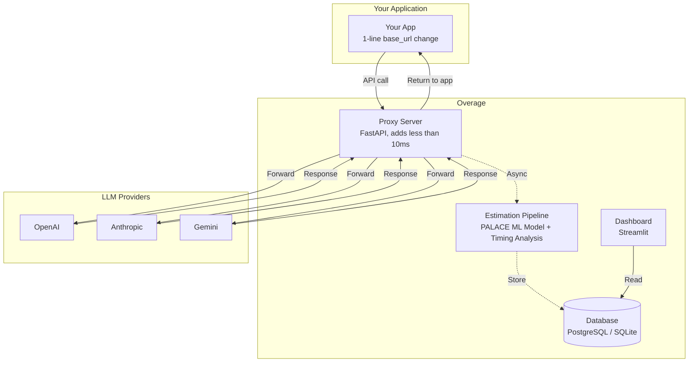

# Overage

**Independent audit layer for hidden LLM reasoning token billing.**

[](https://github.com/ishrith-gowda/overage/actions/workflows/ci.yml)
[](https://codecov.io/gh/ishrith-gowda/overage)
[](https://opensource.org/licenses/MIT)
[](https://www.python.org/downloads/)

---

## What is Overage?

Overage is a FastAPI reverse proxy that sits between your application and LLM providers (OpenAI, Anthropic, Google Gemini), intercepts reasoning model API calls, and independently verifies provider-reported reasoning token counts. It uses two signals: (1) a LoRA-fine-tuned Qwen2.5-1.5B estimation model based on the PALACE framework, and (2) response timing analysis that cross-validates token counts against expected generation speeds. No provider cooperation required.

## The Problem

LLM reasoning models (OpenAI o3/o4-mini, Anthropic Claude with extended thinking, Gemini Flash Thinking) generate hidden "reasoning tokens" that represent 60-90%+ of your total bill. These tokens are reported by the provider with zero independent verification. Every billing tool in the ecosystem (Stripe, CloudZero, Vantage, Helicone) passes through provider-reported numbers without questioning them. There is a structural incentive for providers to over-report reasoning tokens, and until Overage, no tool existed to independently verify these counts. If you are spending $50K+/month on LLM APIs, you are paying bills you cannot audit.

## Architecture



## Quickstart

### Prerequisites

- Python 3.12+
- Git
- (Optional) An OpenAI or Anthropic API key for live proxying

### Setup

```bash
# Clone the repository
git clone https://github.com/ishrith-gowda/overage.git
cd overage

# Create and activate virtual environment
python -m venv .venv
source .venv/bin/activate  # On Windows: .venv\Scripts\activate

# Install the package in editable mode (required for `import proxy` and scripts)
make install-dev
# Equivalent: pip install -e ".[dev]"

# Copy environment template and configure
cp .env.example .env
# Edit .env with your API keys (optional for demo mode)

# Development mode creates SQLite tables on startup. When Alembic migrations
# exist, run: make migrate

# Generate demo data (no API keys needed). Note the printed demo API key for the dashboard.
make demo

# Start the proxy server (port 8000)
make run

# In a separate terminal, start the dashboard (port 8501)
make run-dashboard

# Open the dashboard and paste your Overage API key (from `make demo` output or
# POST /v1/auth/register then POST /v1/auth/apikey).
open http://localhost:8501
```

If SQLite reports “readonly database” on some removable drives (exFAT), set `DATABASE_URL` in `.env` to a path on your local disk (for example under your home directory).

### Verify It Works

```bash
# Health check
curl http://localhost:8000/health

# Expected response:
# {"status": "healthy", "version": "0.1.0", ...}
```

## API Usage

### Proxying an OpenAI Call

The only change to your existing code is the base URL:

```bash
# Direct OpenAI call (before)
curl https://api.openai.com/v1/chat/completions \
  -H "Authorization: Bearer $OPENAI_API_KEY" \
  -H "Content-Type: application/json" \
  -d '{"model": "o3", "messages": [{"role": "user", "content": "What is 2+2?"}]}'

# Proxied through Overage (after — same request, different URL)
curl http://localhost:8000/v1/proxy/openai \
  -H "X-API-Key: $OVERAGE_API_KEY" \
  -H "Authorization: Bearer $OPENAI_API_KEY" \
  -H "Content-Type: application/json" \
  -d '{"model": "o3", "messages": [{"role": "user", "content": "What is 2+2?"}]}'
```

### Python SDK (OpenAI)

Point the client at Overage and pass your Overage API key on every request. The OpenAI SDK posts to `{base_url}/chat/completions`, which Overage exposes at `/v1/proxy/openai/chat/completions`.

```python
import os
from openai import OpenAI

client = OpenAI(
    base_url="http://localhost:8000/v1/proxy/openai",
    api_key=os.environ["OPENAI_API_KEY"],
    default_headers={"X-API-Key": os.environ["OVERAGE_API_KEY"]},
)

response = client.chat.completions.create(
    model="o3",
    messages=[{"role": "user", "content": "Solve this math problem..."}],
)
```

### Viewing Discrepancies

```bash
# List recent calls with discrepancy data
curl http://localhost:8000/v1/calls \
  -H "X-API-Key: $OVERAGE_API_KEY"

# Get aggregate summary
curl http://localhost:8000/v1/summary \
  -H "X-API-Key: $OVERAGE_API_KEY"
```

## Dashboard

<!-- TODO: Replace with actual screenshot after April 6 demo -->


*The dashboard shows: total calls audited, average discrepancy percentage, estimated dollar overcharge, per-provider breakdown, time-series discrepancy chart, and a sortable table of individual API calls with reported vs. estimated token counts.*

## Configuration

| Variable | Description | Required |
|----------|-------------|----------|
| `DATABASE_URL` | Database connection string | Yes |
| `OPENAI_API_KEY` | OpenAI API key for proxying | No* |
| `ANTHROPIC_API_KEY` | Anthropic API key for proxying | No* |
| `API_KEY_SECRET` | Secret for hashing Overage API keys | Yes (prod) |
| `SENTRY_DSN` | Sentry error tracking DSN | No |
| `RATE_LIMIT_PER_MINUTE` | Max requests per API key per minute | No (default: 100) |
| `PALACE_MODEL_PATH` | Path to PALACE LoRA weights | No |
| `ESTIMATION_ENABLED` | Enable async estimation pipeline | No (default: true) |

*At least one provider API key is needed for live proxying. Demo mode works without any API keys.

See [INSTRUCTIONS.md](./INSTRUCTIONS.md) for the complete environment variable reference.

## Documentation

| Document | Description |
|----------|-------------|
| [INSTRUCTIONS.md](./INSTRUCTIONS.md) | Developer guide: coding standards, patterns, commands |
| [ARCHITECTURE.md](./ARCHITECTURE.md) | System architecture, diagrams, technology decisions |
| [PRD.md](./PRD.md) | Product requirements, user stories, data models, API contracts |
| [.github/copilot-instructions.md](.github/copilot-instructions.md) | GitHub Copilot-specific patterns and templates |

## Development

```bash
# Run all checks (lint + typecheck + test)
make check

# Run tests only
make test

# Format code
make format

# Generate a new database migration
make migration

# See all available commands
make help
```

## Contributing

We welcome contributions. Please read [INSTRUCTIONS.md](./INSTRUCTIONS.md) for coding standards, naming conventions, and the PR process. All code must pass `make check` before merging.

Key requirements:
- Full type annotations on every function
- Google-style docstrings
- Structured logging via structlog (no print statements)
- Tests for every new feature (pytest, naming convention: `test_<func>_<scenario>_<expected>`)

## Research Foundations

Overage builds on peer-reviewed research in LLM computation verification:

- **PALACE Framework** (arXiv:2508.00912) — Prompt-based reasoning token estimation using fine-tuned language models
- **Timing Correlation** (arXiv:2412.15431) — Strong correlation (Pearson >= 0.987) between output token count and generation time
- **IMMACULATE** (arXiv:2602.22700) — Cryptographic verification approach (complementary; requires provider cooperation)

## License

MIT License. See [LICENSE](./LICENSE) for details.

---

**Overage** — Trust, but verify.
